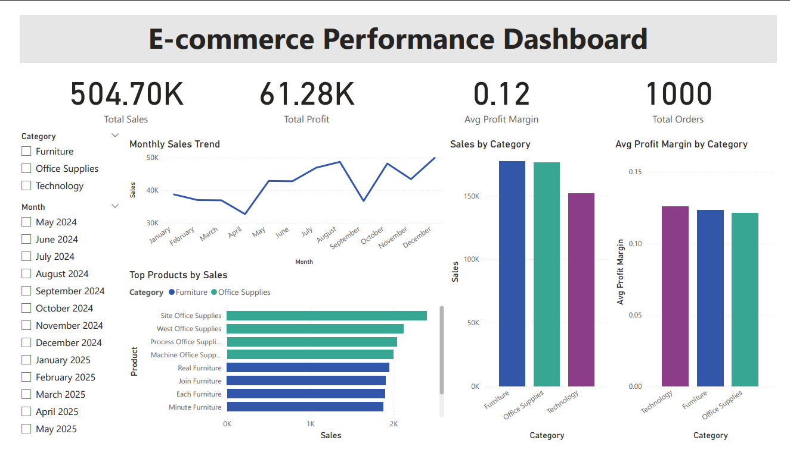

# 🛒 E-Commerce Sales Analysis Dashboard

A data analysis and visualization project exploring a mock e-commerce dataset using Python and Power BI.

## 📁 Project Overview

This project analyzes sales, profit, and customer behavior from a simulated e-commerce store. It combines data cleaning in Python, exploratory data analysis (EDA), and an interactive dashboard built in Power BI.

---

## 📊 Key Features

- Cleaned and preprocessed transaction data with Python (Pandas)
- Visualized key trends and patterns with Matplotlib and Seaborn
- Built an interactive Power BI dashboard with:
  - Sales trends over time
  - Top-selling products and categories
  - KPI summary cards and slicers

---

## 🧰 Tools Used

- **Python** (Pandas, Matplotlib, Seaborn)
- **Power BI**
- **Excel** (initial review)
- **GitHub** (version control)

---

## 🧼 Data Cleaning Steps

- Removed duplicate records
- Handled missing values
- Converted dates and numeric fields
- Verified and normalized data types

---

## 📈 Python Visualizations

- Sales distribution by category
- Monthly sales and profit trends
- Profit margin analysis
- Correlation between discount and profitability

---

## 🧮 Power BI Dashboard

- KPI Cards: Total Sales, Orders, Profit, Avg. Profit Margin
- Time Series Chart: Monthly Sales
- Bar Charts: Sales by Category, Region
- Dynamic filters (slicers) for Category, and Order Date

---

## 📂 Files Included

- `ecommerce_mockup.csv` – Dataset
- `cleaning_script.py` – Python notebook for cleaning & EDA
- `ecommerce_visuals.pbix` – Power BI dashboard file
- `README.md` – This file

---

## 🚀 How to Run

1. Clone the repo  
2. Open the `.py` file to explore the data in Python  
3. Open `dashboard.pbix` in Power BI Desktop to view the dashboard
